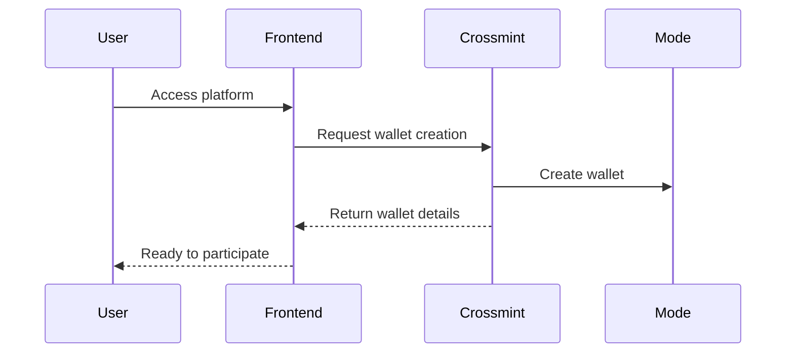
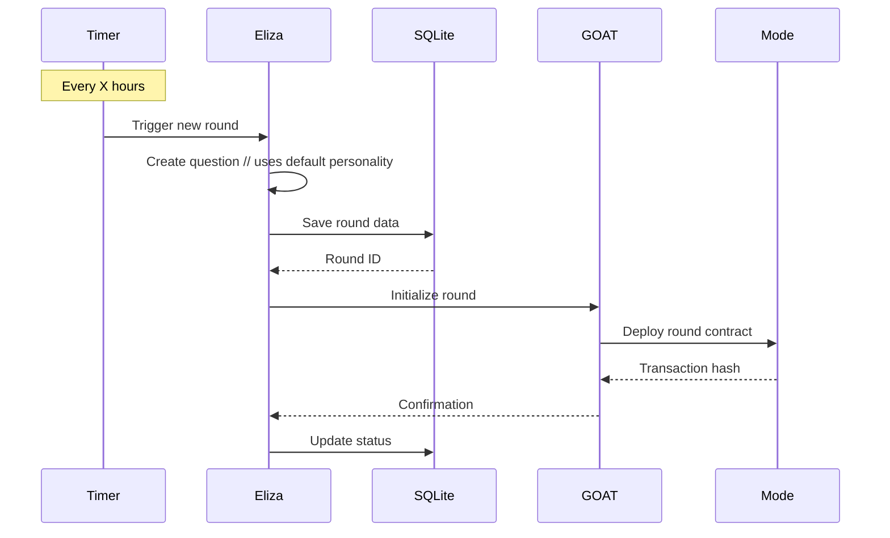
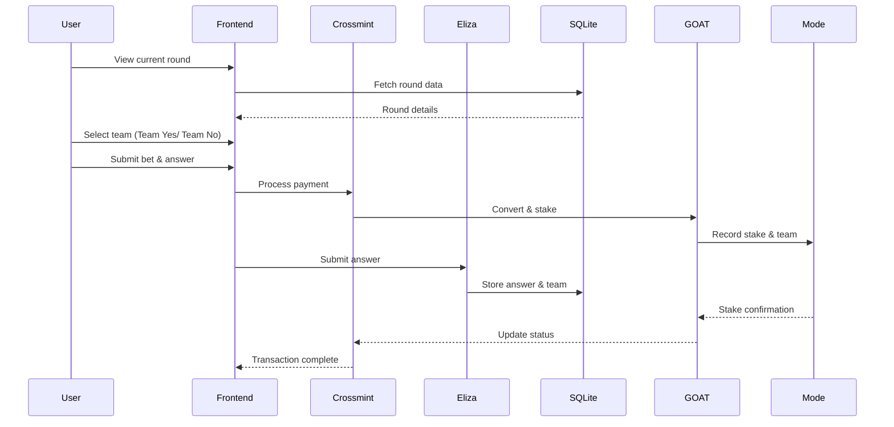
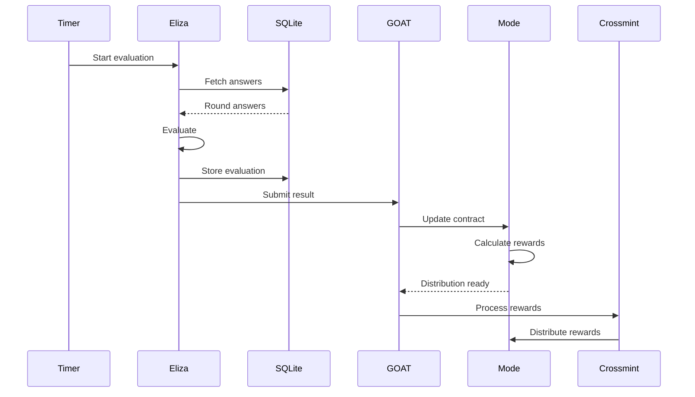

# System Flows

## Core Process Flows

### 1. User Onboarding Flow

```mermaid
sequenceDiagram
    participant User
    participant Frontend
    participant Crossmint
    participant Mode

    User->>Frontend: Access platform
    Frontend->>Crossmint: Request wallet creation
    Crossmint->>Mode: Create wallet
    Crossmint-->>Frontend: Return wallet details
    Frontend-->>User: Ready to participate
```

### 2. Round Management Flow

```mermaid
sequenceDiagram
    participant Timer
    participant Eliza
    participant SQLite
    participant GOAT
    participant Mode

    Note over Timer: Every X hours
    Timer->>Eliza: Trigger new round
    
    Eliza->>Eliza: Create question // uses default personality
    Eliza->>SQLite: Save round data
    SQLite-->>Eliza: Round ID
    
    Eliza->>GOAT: Initialize round
    GOAT->>Mode: Deploy round contract
    Mode-->>GOAT: Transaction hash
    GOAT-->>Eliza: Confirmation
    
    Eliza->>SQLite: Update status
```

### 3. User Participation Flow

```mermaid
sequenceDiagram
    participant User
    participant Frontend
    participant Crossmint
    participant Eliza
    participant SQLite
    participant GOAT
    participant Mode

    User->>Frontend: View current round
    Frontend->>SQLite: Fetch round data
    SQLite-->>Frontend: Round details
    
    User->>Frontend: Select team (Team Yes/ Team No)
    User->>Frontend: Submit bet & answer
    Frontend->>Crossmint: Process payment
    Crossmint->>GOAT: Convert & stake
    GOAT->>Mode: Record stake & team
    
    Frontend->>Eliza: Submit answer
    Eliza->>SQLite: Store answer & team
    
    Mode-->>GOAT: Stake confirmation
    GOAT-->>Crossmint: Update status
    Crossmint-->>Frontend: Transaction complete
```

### 4. Evaluation & Reward Flow

```mermaid
sequenceDiagram
    participant Timer
    participant Eliza
    participant SQLite
    participant GOAT
    participant Mode
    participant Crossmint

    Timer->>Eliza: Start evaluation
    Eliza->>SQLite: Fetch answers
    SQLite-->>Eliza: Round answers
    
    Eliza->>Eliza: Evaluate
    Eliza->>SQLite: Store evaluation
    
    Eliza->>GOAT: Submit result
    GOAT->>Mode: Update contract
    Mode->>Mode: Calculate rewards
    
    Mode-->>GOAT: Distribution ready
    GOAT->>Crossmint: Process rewards
    Crossmint->>Mode: Distribute rewards
    
```
